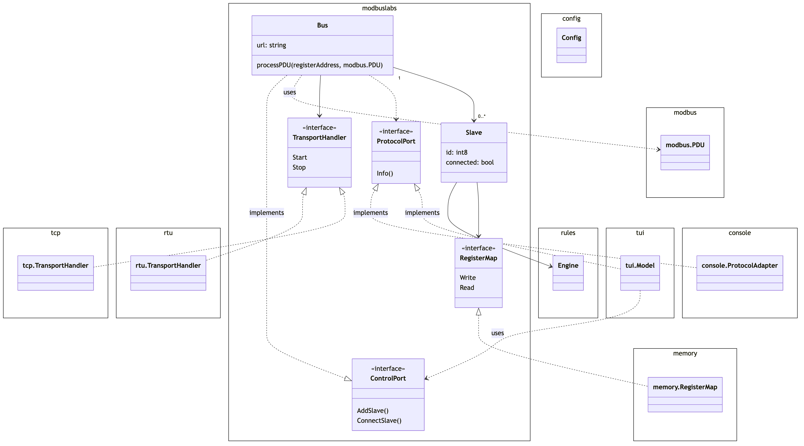

# Modbuslabs

## Slavesim

Slavesim is a cross-platform Modbus slave simulator. Slavesim serves the development of Modbus master applications without requiring actual Modbus devices. Slavesim simulates up to two buses, on which multiple Modbus slaves can be connected. Slaves can be connected and disconnected independently of each other, so that master applications can be developed for handling fragile connections. Each slave manages its own register tables, which can be written to and read from by the master.

### Design

### Using

Write Coil:
go run cmd/master/main.go --bool=true --address=0x7E33 --fc=5

Write Float:
go run cmd/master/main.go --float=12.33 --address=0x9000 --fc=16

Read Float:
go run cmd/master/main.go --address 0x9000 --fc=4 --quantity=2
