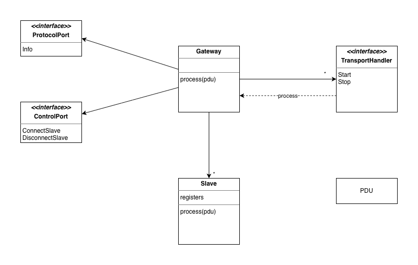

# Modbuslabs

## VirtualONS

VirtualONS is a cross-platform Modbus slave simulator. Slavesim serves the development of Modbus master applications without requiring actual Modbus devices. Slavesim simulates up to two buses, on which multiple Modbus slaves can be connected. Slaves can be connected and disconnected independently of each other, so that master applications can be developed for handling fragile connections. Each slave manages its own register tables, which can be written to and read from by the master.

## Configuration

Slavesim searches for its configurtion file slavesim.toml in $HOME/.config/slavesim. See [slavesim.example.toml](slavesim.example.toml) for avaialble settings.

## Supported Modbus Functions

- FC2: Read discrete registers

### Design



### Usage


#### Run slavesim (aka LDSMock, virtualONS)
```
sudo run cmd/slavesim/main.go
```

#### Read or write data

```bash
# Write coil
go run cmd/master/main.go --value=true --address=0x7E33 --fc=5
```

```bash
# Write float32
go run cmd/master/main.go --value=12.33 --address=0x9000 --fc=16
```

```bash
# Read float32
go run cmd/master/main.go --address 0x9000 --fc=4 --quantity=2
```

## Note about port forwarding
Slavesim runs on tcp:502 and 503 (see default config). If you want to run the simulator without sudo, change the ports in your config to non-privileged ones like 5502. The following macOS command forwards 502 traffic to 5502 if you still want to be able to serve masters connecting via 502.

```
echo "rdr pass on lo0 inet proto tcp from any to any port 502 -> 127.0.0.1 port 5502" | sudo pfctl -ef -
```


