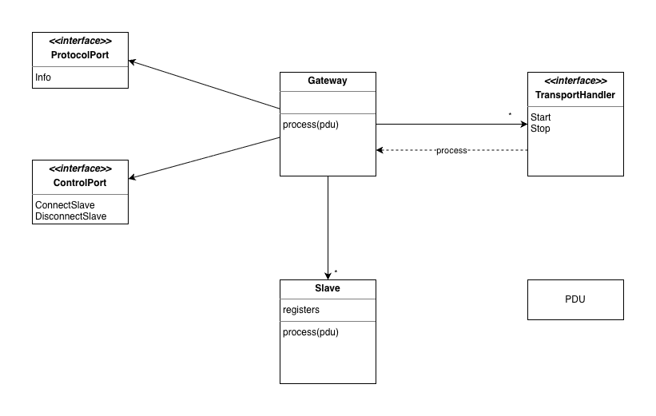

# Modbuslabs

## SlaveSim

SlaveSim is a cross-platform Modbus slave simulator. SlaveSim serves the
development of modbus master applications without requiring actual modbus
devices. SlaveSim simulates up to two buses, on which multiple modbus slaves
can be connected. Slaves can be connected and disconnected independently of
each other, so that master applications can be developed for handling fragile
connections. Each slave manages its own register tables, which can be written
to and read from by the master.

## Configuration

SlaveSim searches for its configurtion file SlaveSim.toml in
$HOME/.config/slavesim. See
[slavesim.example.toml](slavesim.example.toml) for avaialble
settings.

## Supported Modbus Functions

- FC2: Read Discrete Inputs
- FC3: Read Holding Registers
- FC4: Read Input Registers
- FC5: Write Single Coil
- FC6: Write Single Register
- FC16: Write Multiple Registers
- FC17: Read/Write Multiple Registers

## Rules

SlaveSim can simulate stateful device behavior through rules attached to a
slave's registers. Each rule reacts to a read or write on a given register and
performs an action.

**Triggers**

- `on_read` — fires when the master reads the register
- `on_write` — fires when the master writes the register
- `on_read_write` — fires on both

**Actions**

- `set_value` — set the register to a fixed value
- `increment` / `decrement` — adjust the register value
- `toggle` — flip the register value
- `write_register` — write a value to a different register
- `plugin` — delegate to a custom Go plugin implementing
  `rules.Plugin` for stateful behavior beyond a simple action

A rule can optionally match only a specific write `value`, or `"any"`
to match every write.

Example: simulate a firmware update sequence.

```toml
[[slave]]
id = 101
address = "localhost:502"

  [[slave.rule]]
  trigger = "on_write"
  register = 0xA66D            # command register
  value = 0x0100               # firmware update
  action = "write_register"
  write_register = 0xA668      # status register
  write_value = 0x1000         # ready for upload
```

Rules that need more complex, stateful logic (e.g. receiving a multi-packet
firmware image) can delegate to a plugin instead of an action:

```toml
  [[slave.rule]]
  trigger = "on_write"
  register = 0xA672
  value = "any"
  plugin = "receive_package"
```

### Design



### Usage

## Modbus RTU

When a transport is configured with `type = "rtu"`, SlaveSim automatically
launches a `socat` process to create a virtual serial port pair. The two TTY
paths in the config have distinct roles:

- `address` — the slave-side TTY that SlaveSim's RTU handler listens on

- `peer_address` — the client-side TTY that the master or any other tool 
  connects to

```toml
[[transport]]
type        = "rtu"
address     = "/tmp/ttyV0"
peer_address = "/tmp/ttyV1"
```

SlaveSim owns the lifecycle of the socat process: it is started before the
gateway comes up and killed when SlaveSim exits. No manual socat setup is
required.

#### Read or write data

```bash
# Write coil
go run cmd/master/main.go --value=true --address=0x7E33 --fc=5 --transport=tcp
```

```bash
# Write float32
go run cmd/master/main.go --value=12.33 --address=0x9000 --fc=16 --transport=tcp
```

```bash
# Read float32
go run cmd/master/main.go --address 0x9000 --fc=4 --quantity=2 --transport=tcp
```

## Note about port forwarding

SlaveSim runs on tcp:502 and 503 (see default config). If you want to run the
simulator without sudo, change the ports in your config to non-privileged ones
like 5502. The following macOS command forwards 502 traffic to 5502 if you
still want to be able to serve masters connecting via 502.

```
MacOS
echo "rdr pass on lo0 inet proto tcp from any to any port 502 -> 127.0.0.1 port 5502" | sudo pfctl -ef -

Linux
sudo iptables -t nat -A OUTPUT -p tcp --dport 502 -j REDIRECT --to-port 5502
```
